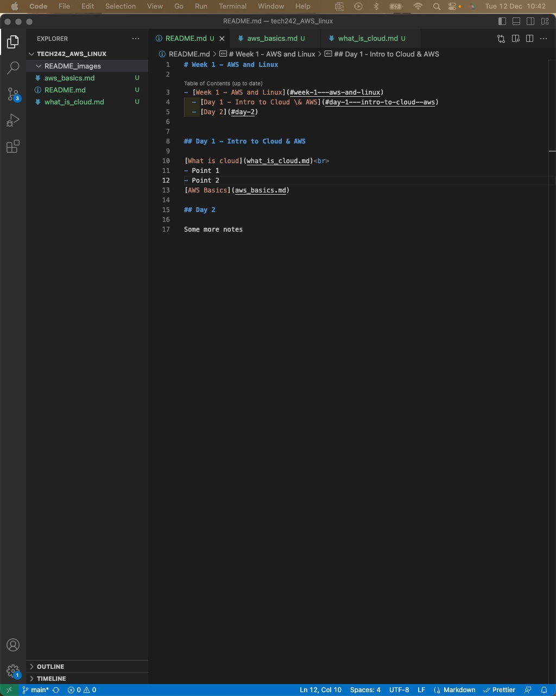

# Week 1 - AWS and Linux

- [Week 1 - AWS and Linux](#week-1---aws-and-linux)
  - [Day 1 - Intro to Cloud \& AWS](#day-1---intro-to-cloud--aws)
  - [Day 2](#day-2)
  - [How to change directories in Linux](#how-to-change-directories-in-linux)

## Day 1 - Intro to Cloud & AWS

[What is cloud](what_is_cloud.md) 
- Point 1
- Point 2
[AWS Basics](aws_basics.md)

## Day 2

[Linux README](linux/README.md)
[Title](managing_file_ownership/task_2.8a.md)

## How to change directories in Linux

Change directory using this command: 'cd <directory>'

Change directory using this command:
'''
cd <directory>
<other commands>
'''