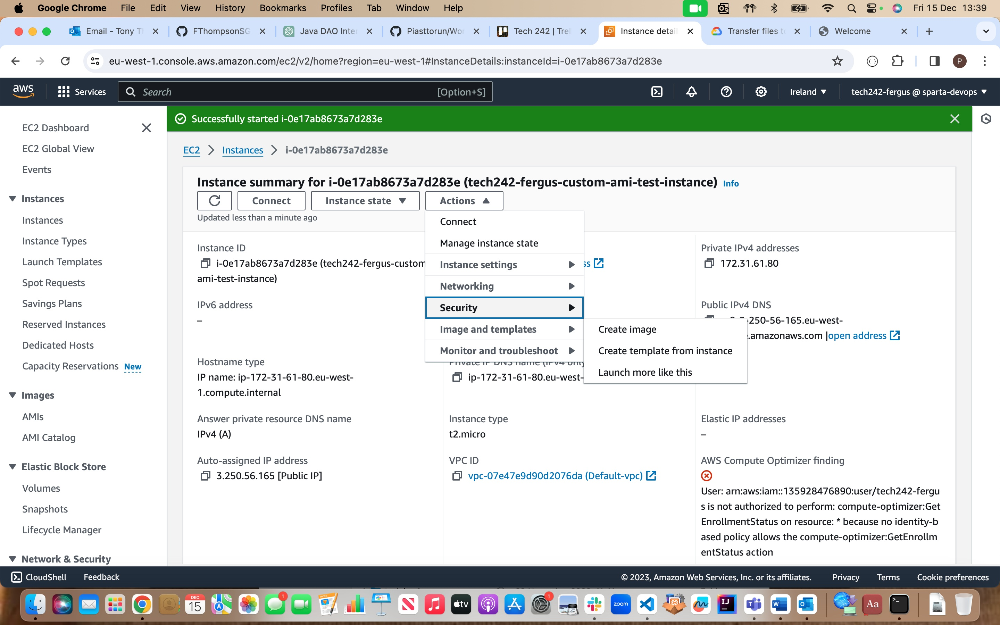
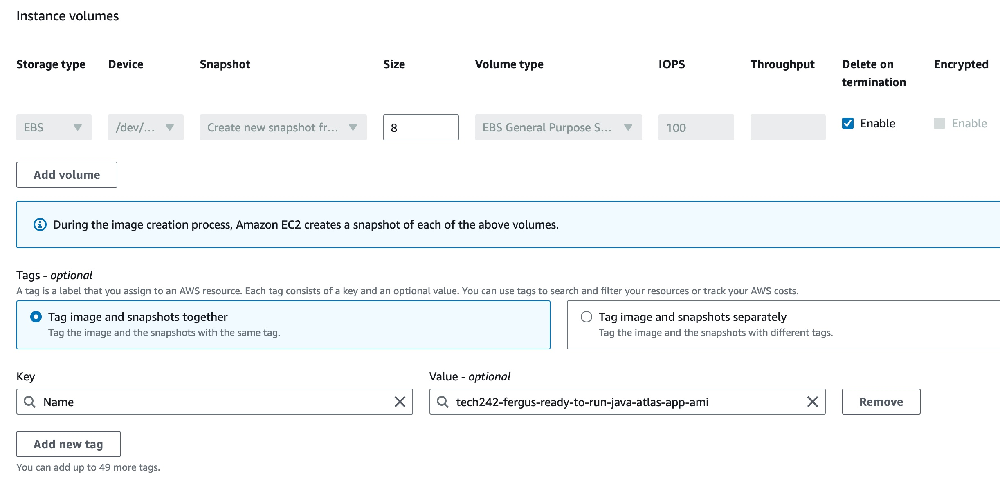

- [AWS Instance Launch Process](#aws-instance-launch-process)
- [AWS Custom AMI Creation](#aws-custom-ami-creation)
- [AMI Deregistering and Snapshot Deletion](#ami-deregistering-and-snapshot-deletion)
- [Classic Ports To Know](#classic-ports-to-know)
- [EC2 Instance Purchasing Options](#ec2-instance-purchasing-options)
- [AWS Load Balancers](#aws-load-balancers)
- [Snow Family](#snow-family)
  - [Highly secure, offline, protable devices to collect and process data at the edge and/or migrate data in and out of AWS](#highly-secure-offline-protable-devices-to-collect-and-process-data-at-the-edge-andor-migrate-data-in-and-out-of-aws)
- [AWS Storage Gateway](#aws-storage-gateway)
- [AWS Databases](#aws-databases)
  - [AWS RDS (Relational Database Service)](#aws-rds-relational-database-service)
    - [RDS vs Deploying DB on EC2](#rds-vs-deploying-db-on-ec2)
  - [Amazon Aurora](#amazon-aurora)
    - [Aurora Serverless](#aurora-serverless)
  - [RDS Deployments](#rds-deployments)
    - [Read Replicas](#read-replicas)
    - [Multi-AZ](#multi-az)
    - [Multi-Region (Read Replicas)](#multi-region-read-replicas)
  - [Amazon ElastiCache](#amazon-elasticache)
  - [DynamoDB](#dynamodb)
    - [DynamoDB Acceleraor - DAX](#dynamodb-acceleraor---dax)
    - [DynamoDB - Global Tables](#dynamodb---global-tables)
  - [Redshift](#redshift)
    - [Redshift Serverless](#redshift-serverless)
  - [Amazon EMR (Elastic MapReduce) - Not a Database](#amazon-emr-elastic-mapreduce---not-a-database)
  - [Amazon Athena](#amazon-athena)
  - [Amazon QuickSight](#amazon-quicksight)
  - [DocumentDB](#documentdb)
  - [Amazon Neptune](#amazon-neptune)
  - [Amazon Timestream](#amazon-timestream)
  - [Amazon QLDB (Quantum Ledger Database)](#amazon-qldb-quantum-ledger-database)
  - [Amazon Managed Blockchain](#amazon-managed-blockchain)
  - [AWS Glue](#aws-glue)
  - [DMS (Data Migration Service)](#dms-data-migration-service)
- [Databases \& Analytics Summary in AWS (For AWS CCP Exam)](#databases--analytics-summary-in-aws-for-aws-ccp-exam)
- [Docker (not on exam)](#docker-not-on-exam)
  - [Where Docker images are stored?](#where-docker-images-are-stored)
  - [Docker vs Virtual Machines](#docker-vs-virtual-machines)
- [ECS (Elastic Container Service)](#ecs-elastic-container-service)
- [Fargate](#fargate)
- [ECR (Elastic Container Registry)](#ecr-elastic-container-registry)
- [Serverless](#serverless)
- [Lambda](#lambda)
  - [Benefits](#benefits)
  - [Language Support](#language-support)
- [Amazon API Gateway](#amazon-api-gateway)
- [AWS Batch](#aws-batch)
- [Amazon Lightsail](#amazon-lightsail)
- [Other Computer Summary](#other-computer-summary)
- [Lambda Summary](#lambda-summary)
- [CloudFormation](#cloudformation)
  - [Benefits](#benefits-1)
- [AWS CDK (Cloud Development Kit)](#aws-cdk-cloud-development-kit)
- [AWS Elastic Beanstalk](#aws-elastic-beanstalk)
- [AWS CodeDeploy](#aws-codedeploy)
- [AWS CodeCommit](#aws-codecommit)
- [AWS CodeBuild](#aws-codebuild)
- [AWS CodePipeline](#aws-codepipeline)
- [AWS CodeArtifact](#aws-codeartifact)
- [AWS CodeStar](#aws-codestar)
- [AWS Cloud9](#aws-cloud9)
- [AWS Systems Manager (SSM)](#aws-systems-manager-ssm)
- [Systems Manager - SSM Session Manager](#systems-manager---ssm-session-manager)
- [SSM Parameter Store](#ssm-parameter-store)
- [Global Applications in AWS](#global-applications-in-aws)
- [Amazon Route 53](#amazon-route-53)
- [AWS CloudFront](#aws-cloudfront)
  - [CloudFront - Origins](#cloudfront---origins)
  - [CloudFront vs S3 Cross Region Replication](#cloudfront-vs-s3-cross-region-replication)
- [S3 Transfer Acceleration](#s3-transfer-acceleration)
- [AWS Global Accelerator](#aws-global-accelerator)
- [AWS Outposts](#aws-outposts)
- [AWS WaveLength](#aws-wavelength)
- [AWS LocalZones](#aws-localzones)
- [Cloud Integration](#cloud-integration)
- [Amazon SQS (Simple Queue Service)](#amazon-sqs-simple-queue-service)
  - [Standard Queue](#standard-queue)
  - [FIFO Queue](#fifo-queue)
- [Amazon Kinesis](#amazon-kinesis)
- [Amazon SNS (Simple Notification Service)](#amazon-sns-simple-notification-service)
- [Amazon MQ](#amazon-mq)
- [Amazon CloudWatch Metrics](#amazon-cloudwatch-metrics)
- [Amazon CloudWatch Alarms](#amazon-cloudwatch-alarms)
- [Amazon CloudWatch Logs](#amazon-cloudwatch-logs)
  - [Logs for EC2](#logs-for-ec2)
- [AWS EventBridge](#aws-eventbridge)
- [AWS CloudTrail](#aws-cloudtrail)
- [AWS X-Ray](#aws-x-ray)
- [Amazon CodeGuru](#amazon-codeguru)
  - [Reviewer](#reviewer)
  - [Profiler](#profiler)
- [AWS Health Dashboard](#aws-health-dashboard)
  - [Service](#service)
  - [Your Account](#your-account)
- [VPC (Virtual Private Cloud)](#vpc-virtual-private-cloud)
- [IP Addresses in AWS](#ip-addresses-in-aws)
- [VPC and Subnets Primer](#vpc-and-subnets-primer)
  - [Internet Gateways and NAT Gateways](#internet-gateways-and-nat-gateways)
- [Network ACL and Security Groups](#network-acl-and-security-groups)
- [VPC Flow Logs](#vpc-flow-logs)
- [VPC Peering](#vpc-peering)
- [VPC Endpoints](#vpc-endpoints)
- [AWS PrivateLink (VPC Endpoint Services)](#aws-privatelink-vpc-endpoint-services)
- [Site to Site VPN \& Direct Connect](#site-to-site-vpn--direct-connect)
- [Client VPN](#client-vpn)
- [Transit Gateway](#transit-gateway)
- [AWS Shared Responsibility Model](#aws-shared-responsibility-model)
  - [RDS](#rds)
  - [S3](#s3)
- [DDoS Protection: WAF and Shield](#ddos-protection-waf-and-shield)
    - [DDoS (Distributed Denial-of-Service) is when an attacker has master servers that launch many bots to make requests to the application server and throttle it so it will not be accessible or responsive to normal users](#ddos-distributed-denial-of-service-is-when-an-attacker-has-master-servers-that-launch-many-bots-to-make-requests-to-the-application-server-and-throttle-it-so-it-will-not-be-accessible-or-responsive-to-normal-users)
  - [AWS Shield](#aws-shield)
  - [AWS WAF - Web Application Firewall](#aws-waf---web-application-firewall)
- [AWS Network Firewall](#aws-network-firewall)
- [AWS Firewall Manager](#aws-firewall-manager)
- [Penetration Testing on AWS Cloud](#penetration-testing-on-aws-cloud)
- [Encryption with KMS and CloudHSM](#encryption-with-kms-and-cloudhsm)
  - [Data at rest vs Data in transit](#data-at-rest-vs-data-in-transit)
  - [AWS KMS (Key Management Service)](#aws-kms-key-management-service)
  - [CloudHSM](#cloudhsm)
    - [Types of KMS Keys](#types-of-kms-keys)
- [AWS Certificate Manager (ACM)](#aws-certificate-manager-acm)
- [AWS Secrets Manager](#aws-secrets-manager)
- [AWS Artifact](#aws-artifact)
- [Amazon GuardDuty](#amazon-guardduty)

# AWS Instance Launch Process

1.	Enter "cd .ssh" in the terminal to go to relevant directory
2.	Make sure you’re on the Ireland region near top right of screen 
3.	Click Launch Instance
4.	Name instance
5.	Search for AMI 20230424 Ubuntu ending in 1e9 in Community AMIs
    

6.	Instance Type – t2.micro Free Tier Eligible
7.	Select key pair – tech242
8.	Select existing security group or create new one if one does not exist
    

9.	If creating, allow SSH (from your IP) and HTTP traffic
10.	Select my IP
    
11.	Provide security group name
12. If you need to add an additional security group rule, add the port and change the source type to anywhere usually.
    

13.	Check summary then click Launch instance

14.	Copy and paste link e.g. "chmod 400 tech242.pem" from next page into terminal
15.	Copy and paste link e.g. "ssh -i "tech242.pem" ubuntu@ec2-3-249-250-55.eu-west-1.compute.amazonaws.com" from next page into terminal
    

16.	Type and enter yes
17.	Should be connected/logged in, type exit to exit then manually stop on AWS website

# AWS Custom AMI Creation

AMIs (Amazon Machine Images) are like a snapshot or a template of a virtual computer that you can use as a starting point to create new virtual machines. It is like a pre-configured package that includes an operating system, software, and any additional configurations you need. In simple terms, an AMI is a blueprint for creating virtual machines in AWS. You can choose from a variety of publicly available AMIs or create custom ones to suit your specific requirements.

1. On your current running instance you want an image of, click on Actions, scroll down to Image and templates and select Create image.
   

2. Enter an image name e.g. "tech242-fergus-ready-to-run-java-atlas-app-ami"
3. Enter a description e.g. "Linux 22.04 LTS, maven, JDK 17, app folder"

4. Add a new tag at the bottom, key should be Name and the value should be the same as the image name you entered above
   

5. Once those details are entered, hit Create image in the bottom right hand corner.
6. You can then launch an instance from the AMI page you will be redirected to
   

7. Create instance as usual but your custom AMI will now be selected
8. If required make sure to include user data for commands such as cd or mvn spring-boot:start

# AMI Deregistering and Snapshot Deletion

1. Go to the AMIs by clicking AMIs on the left hand side of the screen under Images.
2. Find your specific AMI from the list, check the box and under the actions tab click deregister.
3. A pop up will open and you need to click delete snapshot then follow the hyperlink to open the snapshots in a new tab, this will lead you to the specific snapshot automatically
4. Go back to the AMI and confirm deregister.
5. Go back to the snapshot page, check the box and under actions click delete and confirm.

# Classic Ports To Know
- 22 = SSH (Secure Shell) - log in to Linux instance
- 21 = FTP (File Transfer Protocol) - upload files into a file share
- 22 = SFTP (Secure File Transfer Protocol) - upload files using SSH
- 80 = HTTP - access unsecured websites
- 443 = HTTPS - access secured websites
- 3380 = RDP (Remote Desktop Protocol) - log into a Windows instance

# EC2 Instance Purchasing Options

1. On-Demand Instances
Usage: Ideal for short-term, irregular workloads that cannot be interrupted.
Cost: Pay per second or per hour, depending on the instance type, with no long-term commitment.
Flexibility: Start and stop at any time; no upfront payment.

2. Savings Plans
Usage: Suitable for steady-state usage.
Cost: Offers significant savings over On-Demand pricing in exchange for a commitment to a consistent amount of usage (measured in $/hour) for a 1 or 3-year period.
Flexibility: Two types available - Compute Savings Plans (flexible across instance family, region, OS, or tenancy) and EC2 Instance Savings Plans (specific to instances within a family in a region).

3. Reserved Instances (RIs)
Usage: Best for applications with steady-state needs.
Cost: Up to 75% off the On-Demand price. Pricing varies based on the term length, payment option, and instance type.
Flexibility: Options include Standard RIs (significant discount, best for steady, predictable usage) and Convertible RIs (lower discount, can change the RI attributes).
Commitment: 1-year or 3-year term, with payment options including All Upfront, Partial Upfront, or No Upfront.

4. Spot Instances
Usage: Ideal for flexible, stateless, fault-tolerant, or time-insensitive tasks.
Cost: Up to 90% off the On-Demand price. Pricing fluctuates based on supply and demand.
Flexibility: Can be terminated by AWS with a two-minute notification when AWS needs the capacity back.
Risk: Higher risk of interruption compared to other options.

5. Dedicated Hosts
Usage: Necessary for regulatory requirements that may not support multi-tenant virtualization, or for licensing that doesn’t support cloud deployments.
Cost: Pay for the entire physical server. Can be more expensive than other options.
Flexibility: Physical EC2 server dedicated for your use.
Commitment: Available on-demand (hourly) or as a reservation for up to 70% off the On-Demand price.

6. Dedicated Instances
Usage: Similar to Dedicated Hosts but without the allocation of a physical server.
Cost: More expensive than standard instances but cheaper than Dedicated Hosts.
Flexibility: Instances run in a VPC on hardware that's dedicated to a single customer.
Differences from Dedicated Hosts: Instance capacity is not guaranteed, and instances can’t be used to bring your own license (BYOL).

# AWS Load Balancers

1. Application Load Balancer
- HTTP/HTTPS/gRPC protocols (Layer 7)
- HTTP Routing features
- Static DNS (URL)

2. Network Load Balancer
- TCP/UDP protocols (Layer 4)
- High Performance: millions of requests per second
- Static IP through Elastic IP

3. Gateway Load Balancer
- GENEVE Protocol on IP Packets (Layer 3)
- Route Traffic to Firewalls that you manage on EC2 instances
- Intrusion detection

# Snow Family
## Highly secure, offline, protable devices to collect and process data at the edge and/or migrate data in and out of AWS

1. Snowcone - Data Migration and Edge Computing
- Small, portable computing anywhere, rugged & secure and can withstand harsh environments
- Light
- Used in a space-constrained environment
- Must provide own battery/cables
- Can be sent back to AWS offline or connect it to the internet ans use AWS DataSync to send data
  - Snowcone: 8TB of HDD storage
  - Snowcone SSD: 14TB of HDD storage
- Use cases: Edge computing, stroage and data transfer

2. Snowball Edge - Data Migration and Edge Computing
- Physical transport solution intended to move TBs or PBs in or out of AWS
- Alternative to moving data over a network
- Pay per data transfer job (Data transfer in to Amazon S3 is free)
- Provides block storage and Amazon S3 compatible object storage
  - Snowball Edgee Storage Optimised: 80 TB HDD capacity
  - Snowball Edge Compute Optimised: 42 TB of HDD or 28TB NVMe capacity
- Use cases: Large data cloud migrations, DC commission or disaster recovery

3. Snowmobile - Data Migration
- Transfer exabytes of data (1EB = 1,000PB = 1,000,000TBs)
- Each Snowmobile has 100PB capacity (can use multiple in parallel)
- High security: temperature controlled, GPS and 24/7 video surveillance
- Better than Snowball if you transfer more than 10PB

AWS OpsHub is a UI for managing Snowball devices

# AWS Storage Gateway

- Bridge between on-premises data and cloud data in S3
- Use cases: Disaster recovery, backup & restore and tiered storage

# AWS Databases

## AWS RDS (Relational Database Service)
- A managed DB service using SQL
- Allows you to creates DBs in the cloud that are managed by AWS
  - Postgres
  - MySQL
  - MariaDB
  - Oracle
  - Microsoft SQL Server
  - Aurora (AWS Proprietary database)
### RDS vs Deploying DB on EC2
- Automated provisioning, OS patching
- Continuous backups and restore to specific timestamp (Point in Time Restore!)
- Monitoring dashboards
- Read replicas for improved read performance
- Multi AZ setup for disaster recovery
- Maintenance windows for upgrades
- Scaling capability (vertical and horizontal)
- Storage backed up by EBS
- You CANNOT SSH into your instances

## Amazon Aurora
- Proprietary technology from AWS (not open sourced)
- PostgreSQL and MySQL are both supported
- AWS cloud optimised and claims 5x performance improvement over MySQL on RDS and 3x of Postgres on RDS
- Storage automatically grows in increments of 10GB up to 128TB
- Cost 20% more than RDS but is more efficient
- Not in the free tier
### Aurora Serverless
- Automated database instatiation and auto-scaling based on actual usage
- PostgreSQL and MySQL both supported
- No capacity planning needed
- Least management overhead
- Pay per second, can be more cost effective
- Use cases: Good for infrequent, intermittent or unpredictable workloads

## RDS Deployments

### Read Replicas
- Scale the read workload of your DB
- Can create up to 15 Read Replicas
- Data is only written to the main DB

### Multi-AZ
- Failover in case of AZ outage (high availability)
- Creates replica in another AZ which is only used if the main DB fails
- Data is only read/written to the main DB
- Can only have 1 other AZ as failover

### Multi-Region (Read Replicas)
- Creates Read Replicas in other regions that our application can read, only writes to main DB
- Disaster recovery in case of region issue
- Local performance for global reads
- Replication cost

## Amazon ElastiCache
- ElastiCache is to get managed Redis or Memcached
- Caches are in-memory DBs with high performance and low latency
- Helps reduce load off DBs for read intensive workloads
- AWS handles OS maintenance/patching, optimisations, setup, configuration, monitoring, failure recovery and backups.

## DynamoDB
- A fully managed, highly available DB with replication across 3 AZs
- NoSQL DB, not a relational DB
- Scales to massive workloads, distributed "serverless" DB
- Millions of request per seconds, trillions of rows, 100s of TB of storage
- Fast and consistent performance
- Single-digit millisecond latency, low latency retrieval
- Integrated with IAM for security, authorisation and admin
- Low cost and auto scaling capabilities
- Standard and IA Table Class
- Is a key/value DB
### DynamoDB Acceleraor - DAX
- Fully managed in-memory cache for DynamoDB
- 10 x performance improvement, single digit millisecond latency to microseconds latency when accessing DynamoDB tables
- Secure, HS and HA
- Difference with ElastiCache at the CCP level: DAX is only used for and integrated with DynamoDB.
### DynamoDB - Global Tables
- You can make a DynamoDB table accessible with low latency in multiple regions
- Active-Active replication (read/write to any AWS region)

## Redshift
- Based on PostgreSQL but not used for OLTP (online transaction processing)
- It's OLAP - online analytical processing (analytics and data warehousing)
- Loads data once every hour, not every second
- 10x better performance than other data warehouses and scales to PBs of data
- Columnar storage of data (instead of row based)
- Massive Parallel Query Execution (MPP)
- Pay as you go based on the instances provisioned
- Has a SQL interface for performing queries
- BI (business intelligence) tools such as AWS Quicksight or Tableau integrate with it
### Redshift Serverless
- Automatically provisions and scales data warehouse unerlying capacity
- Run analytics workloads without managing data warehouse infrastructure
- Pay only for what you use (saves cost)
- Use cases: Reporting, dashboarding applications, real-time analytics etc...

## Amazon EMR (Elastic MapReduce) - Not a Database
- Helps create Hadoop Clusters (Big Data) to analyze and process vast amounts of data
- The clusters can be made up of hundreds of EC2 instances
- Also supports Apache Spark, HBase, Presto, Flink...
- Takes care of all the provisioning and configuration of the instances
- Auto-scaling and integrated with Spot instances
- Use cases: Data processing, machine learning, web indexing, big data...

## Amazon Athena
- Serverless query service to perform analytics against S3 objects
- Uses standard SQL language to query the files
- Supports CSV, JSON, ORC, Avro and Parquet
- Use cases: BI/analytics/reporting, analyse and query VPC Flow Logs, ELB Logs, CloudTrail trails etc...

## Amazon QuickSight
- Serverless machine learning-powered BI service to create interactive dashboards
- Fast, automatically scalable, embeddable with per-session pricing
- Integrated with RDS, Aurora, Athena, Redshift, S3 etc...
- Use cases: Business analytics, building visualisations, performing ad-hoc analysis and getting business insights using data

## DocumentDB
- Whereas Aurora is an "AWS-implementation" of PostgreSQL/MySQL, DocumentDB is the same for MongoDB(NoSQL database)
- MongoDB is used to store, query and index JSON data
- Similar deployment concepts to Aurora so it's fully managed, HA with replication across 3 AZs
- DocumentDB storage automatically grows in increments of 10GB
- Automatically scales to workloads with millions of requests per second

## Amazon Neptune
- Fully managed graph database
- A popular graph dataset would be a social network
- HA across 3 AZs with up to 15 read replicas
- Build and run applications working with highly connected datasets, optimised for these complex and hard queries
- Can store up to billions of relations and query the graph with milliseconds latency
- Use cases: Knowledge graphs (Wikipedia), fraud detection, recommendation engines, social networking etc...

## Amazon Timestream
- Fully managed, fast, scalable, serverless time series DB
- Automatically scales up/down to adjust capacity
- Store and analyse trillions of events per day
- 1000s times faster and 1/10th the cost of relational DBs
- Built-in time series analytics functions (helps you identify patterns in your data in near real time)

## Amazon QLDB (Quantum Ledger Database)
- A ledger is a book recording financial transactions
- Full managed, serverless, HA with replcation across 3 AZs
- Used to review history of all the changes made to your application data over time
- Immutable system: No entry can be removed or modified, cryptographically verifiable
- 2-3x better performance than common ledger blockchain frameworks, manipulate data using SQL
- Difference with Amazon Managed Blockchain: no decentralisation component, in accordance with financial regulation rules

## Amazon Managed Blockchain
- Blockchain makes it possible to build applications where multiple parties can execute transactions without the need for a trust, central authority (decentralised)
- AMB is a managed service to:
  - Join public blockcahain networks
  - Create your own scalable private network
- Compatible with the frameworks Hyperledger Fabric and Ethereum

## AWS Glue
- Managed extract, transform and load (ETL) service

## DMS (Data Migration Service)
- Quickly and securely migrate DBs to AWS and is resilient and self healing
- The source DB remains available during migration
- Supports:
  - Homogeneous migrations e.g. Oracle to Oracle
  - Heterogenous migrations e.g. Microsoft SQL Server to Aurora

# Databases & Analytics Summary in AWS (For AWS CCP Exam)
- Relational Databases: OLTP - RDS and Aurora (SQL)
- Difference between Multi-AZ, Read Replicas and Multi-Region
- In-memory Databse: ElastiCache (high performance and low latency)
- Key/Value Database: DynamoDB (serverless) and DAX or DynamoDB Accelerator (cache for DynamoDB)
- Warehouse: OLAP - Redshift (SQL)
- Hadoop Cluster: EMR
- Athena: Query data on Amazon S3 (serverless and SQL)
- QuickSight: Dashboards on your data (serverless)
- DocumentDB: "Aurora for MongoDB" (JSON - NoSQL database)
- Amazon QLDB: Financial Transactions Ledger (immutable journal, cryptographically verifiable)
- Amazon Managed Blockchain: Managed Hyperledger Fabric and Ethereum blockchains
- Glue: Managed ETL (Extract Transform Load) and Data Catalogue service
- Database Migration: DMS
- Neptune: Graph database
- Timestream: Time-series database

# Docker (not on exam)
- Software development platform to deploy apps
- Apps are packaged in containers that can be run on any OS
- Apps run the same, regardless of where they're run
  - Any machine
  - No compatibility issues
  - Predictable behaviour
  - Less work
  - Easier to maintain and deploy
  - Works with any language, any OS, any technology
- Scales containers up and down very quickly (seconds)

## Where Docker images are stored?
- Docker images are stored in Docker Repositories
  - Public: Docker Hub
    - Find bases images for many tecnologies or OS such as Ubuntu, MySQL, NodeJS, Java etc...
  - Private: Amazon ECR (Elastic Container Registry)

## Docker vs Virtual Machines
- Dock is "sort of" a virtualisation technology, but not exactly
- Resources are shared with the host => many containers on one server

# ECS (Elastic Container Service)
- Launch Docker containers on AWS
- You must provision and maintain the infrastructure (the EC2 instances)
- AWS takes care of starting/stopping containers
- Has integration with the Application Load Balancer

# Fargate
- Launch Docker containers on AWS
- You DO NOT provision the infrastructure (no EC2 instances to manage) - simpler.
- Serverless offering
- AWS just runs containers for you based on your CPU/RAM needs

# ECR (Elastic Container Registry)
- Private Docker registry on AWS
- This is where you store your Docker images so they can be run by ECS and Fargate

# Serverless
- A new paradigm in whch the developers don't have to manage servers anymore
- They just deploy code/functions
- Initially serverless == Faas (Function as a Service)
- Serverless was pioneered by AWS Lambda but now also includes anything that's managed: "database, messaging, storage etc."
- There are servers but we don't manage, provision or see them.

# Lambda
- Virtual functions - no servers to manage
- Limited by time - short executions
- Run on-demand
- Scaling is automated
## Benefits
- Easy pricing:
  - Pay per request and compute time
  - Free tier of 1,000,000 AWS Lambda requests and 400,000 GBs of compute time
- Integrated with the whole AWS suit of services
- Event-Driven: functions get invoked by AWS when needed
- Integrated with many programming languages
- Easy monitoring through AWS CloudWatch
- Easy to get more resources per functions (up to 10GB of RAM)
- Increeasing RAM will also improve the CPU and network
## Language Support
- Node.js (JavaScript)
- Python
- Java
- C#
- Golang
- C# / Powershell
- Ruby
- Custom Runtime API (community supported, example Rust)
- Lambda Container Image:
  - The container image must implement the Lambda Runtime API
  - ECS / Fargate is preferred to running arbitrary Docker images

# Amazon API Gateway
- Fully managed service for developers to easily create, publish, maintain, monitor and secure APIs
- Serverless and scalable
- Supports RESTful APIs and WebSocket APIs
- Support for security, user authentication, API throttling, API keys, monitoring etc...
- Use case: building a serverless API
  Client <REST API> API Gateway <PROXY REQUESTS> Lambda <CRUD> DynamoDB

# AWS Batch
- Fully managed batch processing at any scale
- Efficiently run 100,000s of computing batch jobs on AWS
- A "batch" job is a job with a start and an end (as opposed to continuous)
- Batch will dynamically launch EC2 instances or Spot Instances
- AWS Batch provisions the right out of compute/memory
- You submit or schedule batch jobs and AWS Batch does the rest
- Batch jobs are defined as Docker images and run on ECS
- Helpful for cost optimisations and focusing less on infrastructure

# Amazon Lightsail
- Virtual servers, storage, databases and networking
- Low and predictable pricing
- Simpler alternative to using EC2, RDS, ELB, EBS Route 53 etc...
- Great for people with little cloud experience
- Can setup notifications and monitoring of your Lightsail resources
- Has HA but not auto-scaling and limited AWS integrations
- Use cases:
  - Simple web applications (has templates for LAMP, Nginx, MEAN, Node.js)
  - Websites (has templates for WordPress, Magento, Plesk, Joomla)
  - Dev/Test environment

# Other Computer Summary
- Docker: container technology to run applications
- ECS: run Docker containers on EC2 instances
- Fargate: run Docker containers without provisioning the infrastructure (serverless)
- ECR: private Docker images repository
- Batch: run batch jobs on AWS across managed EC2 instances
- Lightsail: predictable and low priving for simple application and DB stacks

# Lambda Summary
- Lambda is serverless, FaaS, seamless scaling and reactive
- Lambda billing:
  - By the time run x by the RAM provisioned
  - By the number of invocations
- Language support: many programming languages except (arbitrary) Docker
- Invocation time up to 15 minutes
- Use an API Gateway to expose Lambda functions as HTTP API
- Use cases: Create thumbnails for images uploaded to S3 or run a serverless cron job

# CloudFormation
- A declarative way of outlinng your AWS infrastructure for any resources (most of them are supported)
- For example, within a CloudFormation template you say:
  - I want a security group
  - I was two EC2 instances using this security group
  - I want an S3 bucket
  - I want a load balancer
- Then CloudFormation creates these for you, in the right order, with the exact configuration you specify
## Benefits
- Infrastructure as code
  - No resources are manually created which is excellent for control
  - Changes to the infrastructure are reviewd through code
- Cost
  - Each resource with the stack is tagged with an identifier so you can easily see how much a stack costs you
  - You can estimate the costs of your resources using the CloudFormation template
  - Savings strategy: As a developer, you could automate the deletion of templates at 5pm and recreation at 8am safely
- Productivity
  - Ability to destroy and recreate an infrastructure on the cloud on the fly
  - Automated generation of Diagram for your templates
  - Declarative programming (no need to figure out ordering and orchestration)
- Don't Reinvent the Wheel
  - Leverage existing templates on the web
  - Leverage the documentation
- Supports (almost) all AWS Resources
  - Everything on this course is supported
  - You can use "custom resources" for resources that are not supported

# AWS CDK (Cloud Development Kit)
- Define your cloud infrastructure using a familiar language
- The code is "compiled" into a CloudFormation template (JSON/YAML)
- You can therefore deploy infrastructure and application runtime code together
  - Great for Lambda functions
  - Great for Docker containers in ECS / EKS

# AWS Elastic Beanstalk
- PaaS
- Developer centric view of deploying an application on AWS
- Uses all the components we've seen before but all in one view
- Still have full control over configuration
- Free but you pay for the underlying instances
- Managed service
  - Instance configuration / OS handled by Beanstalk
  - Deployment strategy is configurable but performed by Elastic Beanstalk
  - Capacity provisioning
  - Load balancing and auto-scaling
  - Application health-monitoring and responsiveness
- Only dev responsibility is application code
- Three architectural models:
  - Single instance deployment: good for development
  - LB and ASG: great for production or pre-production web applications
  - ASG only: great for non-web apps in production

# AWS CodeDeploy
- Hybrid service to reploy applications automatically
- Works with EC2 instances AND On-Premises servers
- Servers/instances must be provisioned and configured ahead of time with the CodeDeploy agents

# AWS CodeCommit
- AWS' competing product to GitHub
- Benefits:
  - Full managed
  - Scalable and highly available
  - Private, secured and integrated with AWS

# AWS CodeBuild
- Code building service in the cloud
- Compiles source code, runs tests and produces packages that are ready to be deployed (e.g.by CodeDeploy)
- Benefits:
  - Full managed and serverless
  - Continuously scalable and HA
  - Secure
  - Pay as you go pricing so only pay for the build time

# AWS CodePipeline
- Orchestrates the steps to have coe automatically pushed to production
- Basis for CICD
- Benefits:
  - Fully managed and compatible with previously mentioned AWS services, alsoe 3rd party services e.g. GitHub and custom plugins
  - Fast delivery and rapid updates

# AWS CodeArtifact
- Software packages depend on each other to be built (dependencies) and new ones are created
- Storing and retrieving these dependencies is call artifact management
- Traditionally you need to set a management system up yourself
- CodeArtifact is a secure, scalable and cost-effective artifact management system for software development
- Works with common dependency management tools such as Maven, Gradle etc
- Developers and CodeBuild can retrieve dependencies straight from CodeArtifact

# AWS CodeStar
- Unified UI to easily manage software development activities in one place
- Quick way to get started to correctly set up all the previous services
- Can edit the code in the cloud using AWS Cloud9

# AWS Cloud9
- A cloud IDE used in the web browser
- Allows collaboration in real time

# AWS Systems Manager (SSM)
- Helps you manage your EC2 and On-Premises systems at scale
- Another Hybrid AWS service
- Get operational insights about the state of your infrastructure
- Suite of 10+ products
- Most important features are:
  - Patching automation for enhanced compliance
  - Run commands across an entire fleet of servers
  - Store parameter configuration with the SSM ParameterStore
- Works for Linux, Windows, MacOS and Raspberry Pi OS (Raspbian)
- SSM Agent is installed by default on Amazon Linux AMI and some Ubuntu AMI, otherwise we need to install it
- If an instance cn't be controlled with SSM, it's probably an issue with the agent
- Thanks to the SSM agent we can run commands, patch and configure our servers

# Systems Manager - SSM Session Manager
- Allows you to start a secure shell on your EC2 and on-premises servers
- No SSH access, bastion hosts or SSH keys needed
- No port 22 needed (better security)
- Supports Linux, MacOS and Windows
- Send session log data to S3 or CloudWatch logs

# SSM Parameter Store
- Secure storage for configurations and secrets
- API keys, passwords, configurations...
- Severless, scalable, durable, easy SDK
- Control access permissions using IAM
- Version tracking and encryption (optional)

# Global Applications in AWS
- Global DNS: Route 53
  - Great to route users to the closest deployment with least latency
  - Great for disaster recovery strategies
  - Better protection from attack
- Global Content Delivery Network (CDN): CloudFront
  - Repliccate part of your application to AWS Edge loccations - decrease latency
  - Cache common requests - improved user experience and decreased latency
- S3 Transfer Acceleration
  - Accelerate global uploads and downloads into Amazon S3
- AWS Global Accelerator
  - Improve global application availability and performance using the AWS global network

# Amazon Route 53
- A Managed DNS (Domain Name System)
- DNS is a collection of rules and records which helps clients understand how to reach a server through URLs
- In AWS the most common records are:
  - A record (IPv4)
  - AAAA (IPv6)
  - CNAME: hostname to hostname
  - Alias (e.g. ELB, CloudFront, S3, RDS etc...)
- Routing Policies:
  - Simple Routing Policy (no health checks)
  - Weighted Routing Policy
  - Latency Routing Policy
  - Failover Routing Policy

# AWS CloudFront
- Content Delivery Network (CDN)
- Improves read performance, content is cached at the edge
- Improves user experience
- 216 Points of Presence globally (edge locations)
- DDoS protection (because worldwide), integration with Shield and AWS Web Application Firewall
## CloudFront - Origins
- S3 bucket:
  - For distributing files and caching them at the edge
  - Enhanced security with CcloudFront Origin Access Control (OAC)
  - OAC is replacing Origin Access Identity (OAI)
  - CloudFront can be used an an ingress (to upload files to S3)
- Custom Origin (HTTP)
  - Application Load Balancer
  - EC2 instance
  - S3 website (must first enable the bucket as a static S3 website)
  - Any HTTP backend you want
## CloudFront vs S3 Cross Region Replication
- CloudFront:
  - Global Edge network
  - Files are cahed for a TTL (maybe a day)
  - Great for static content that must be available everywhere
- S3 Cross Region Replication
  - Must be setup for each region you want replication to happen
  - Files are updated in near real time
  - Read only
  - Great for dynamic content that needs to be available at low-latency in few regions

# S3 Transfer Acceleration
- Increase transfer speed by tranferring file to an AWS edge location which will forward the data to the S3 bucket in the target region

# AWS Global Accelerator
- Improve global application availability and performance using the AWS global network
- Leverage the AWS internal network to optimise the route to your application (60% improvement)
- 2 Anycast IP are created for your application and traffix is sent through Edge Locations
- The Edge locations send the traffic to your application

# AWS Outposts
- "Server racks" that offers the same AWS infrastructure, services, APIs and tools to build your own applications on-premises just as in the cloud
- AWS will set up and manage "Outpost Racks" (servers) within your on-premises infrastructure and you can start leveraging AWS services on-premises
- You are responsible for the Outpost Racks physical security
- Benefits:
  - Low-latency access to on-premises systems
  - Local data processing
  - Data residency
  - Easier migration from on-premises to the cloud
  - Fully managed service
- Some services that work on Outposts:
  - EC2, EBS, S3, EKS, ECS, RDS and EMR

# AWS WaveLength
- WaveLength Zones are infrastructure deployments embedded within the telcommunications provider's datacentres at the edge of the 5G networks
- Brings AWS services to the edge of 5G networks
- E.g. EC2, EBS, VPC...
- Ultra-low latency applications through 5G networks
- Traffic doesn't leave the Communication Service Provider's (CSP) network
- High-bandwidth and secure connection to the parent AWS region
- No additional charges or service agreements
- Use cases: Smart Cities, ML-assisted diagnostics, Connected Vehicles, Interactive Live Video Streams, AR/VR, Real-time gaming etc...

# AWS LocalZones
- Places AWS ccompute, storage, database and other selected AWS services closer to the end users to run latency-sensitive applications
- Extend your VPC to more locations - "Extension of an AWS region"
- Compatible with EC2, RDS, ECS, EBS, ElastiCache, Direct Connect etc...

# Cloud Integration
1. Synchronous communications (application to application)
   - Can be problematic if there are sudden spikes in traffic
2. Asynchronous/event based (application to queue to application)

# Amazon SQS (Simple Queue Service)
- Producer -> send message -> SQS Queue -> poll message -> consumer
## Standard Queue
- Oldest AWS offering (over 10 years old)
- Full managed service (serverless) and used to decouple applications
- Scales from 1 message per second to 10,000s per second
- Default rentention of messages: 4 days to a max of 14
- No limit to how many messages can be in the queue
- Messages are deleted after they're read by consumers
- Low latency (<10ms on public and receive)
- Consumers share the work to read messages and scale horizontally
## FIFO Queue
- First In First Out (ordering of messages in the queue)
- Messages are processed in order by the consumer

# Amazon Kinesis
- For the exam: Kinesis = real-time big data streaming
- Managed service to collect, process and analyse real-time streaming data on any scale

# Amazon SNS (Simple Notification Service)
- What if you want to send one message to multiple receivers?
- Pub/Sub (public and subscribe)
- The "event publishers" only sends message to one SNS topic
- As many "event subscribers" as we want to listen to the SNS topic notifications
- Each subscriber to the topic will get all the messages
- Up to 12,5000,000 subscriptions per topics, 100,000 topics limit

# Amazon MQ
- Traditional applications running from on-premises may use open protocols such as: MQTT, AMQP, STOMP, Openwire or WSS
- When migrating to the cloud, instead of re-engineering the application to use SQS and SNS, we can use Amazon MQ
- Amazon MQ is a managed message broker service for RabbitMQ and ActiveMQ
- Amazon MQ doesn't "scale" as much as SQS/SNS
- It runs on servers, can run in Multi-AZ with failover
- Has both queue feature and topic feature

# Amazon CloudWatch Metrics
- Provides metrics for every service in AWS
- Metric is a variable to monitor and have timestamps

# Amazon CloudWatch Alarms
- Alarms are used to trigger notifications for any metric
- Alarm actions:
  - Auto scaling
  - EC2 actions
  - SNS notifications
- Can customise various options e.g. %, min, max etc
- Customise the period on which to evaluate
- Alarm states are OK, INSUFFICIENT_DATA and ALARM

# Amazon CloudWatch Logs
- Can be collected from:
  - Elastic Beanstalk: collection of logs from application
  - ECS: collection from containers
  - AWS Lambda: collection from function logs
  - CloudTrail based on filter
  - CloudWatch log agents: on EC2 machines or on-premises servers
  - Route53: Log DNS queries
- Enables real-time monitoring of logs
- Adjustable CloudWatch logs retention
## Logs for EC2
- By default no logs from your EC2 instance will go to CloudWatch
- You need to run a CloudWatch agent on EC2 to push the log files you want
- Make sure IAM permissions are correct
- The CloudWatch log agent can be set up on-premises too

# AWS EventBridge
- Schedule Cron jobs (scheduled scripts) e.g. every hour trigger a Lambda function
- Event Pattern: Event rules to react to a service doing something e.g. notification if someone logs in as root user
- Trigger Lambda functions, send SQS/SNS messages etc
- Can configure for parnter services to trigger events or custom apps
- You can archive events and replay them

# AWS CloudTrail
- Provides governance, compliance and audit for your AWS account
- Is enabled by default
- Get history of events/API calls made within your AWS account by:
  - Console
  - SDK
  - CLI
  - AWS services
- Can put logs from CloudTrail into CloudWatch Logs or S3
- Can be applied to all regions (default) or a single region
- If a resources is deleted in AWS, investiage CloudTrail first

# AWS X-Ray
- Debugging in Production, the good old way:
  - Test locally
  - Add log statements everywhere
  - Re-deploy in production
- Log formats differ across applications and log analysis is hard
- Debuggin a monolith is easy, distributed services is hard
- No common views of your entire architecture
- With X-Ray:
  - Troubleshooting performance (bottlenecks)
  - Understand dependencies in a microservice architecture
  - Pinpoint service issues
  - Review request behaviour
  - Find errors and exceptions
  - Are we meeting the SLA? (service level agreement)
  - Where am I being throttled?
  - Identify users that are impacted

# Amazon CodeGuru
- A ML-powered service for automated code reviews and application performancce recommendations
- Provides two functionalities:
  - CodeGuru Reviewer: automated code reviews for static code analysis (development so during commit to repo)
  - CodeGuru Profiler: visibility/recommendations about application performance during runtime (production so during build/test and after deployment)
## Reviewer
- Identify crucial issues, security vulnerabilities and hard to find bugs
- Common coding best practices, resource leaks, security detection and input validation
- Uses ML and automated reasoning
- Hard learned lessons across millions of code reviews on 1000s of ooen source and Amazon repos
- Supports Java and Python
- Integrates with GitHub, Bitbucket and Amazon CodeCommit
## Profiler
- Helps understand the runtime behaviour of your application e.g. if your application is consuming excessive CPU capacity on a logging routine
- Features:
  - Identify and remove cod inefficiencies
  - Improved application performance (e.g. reduce CPU utilisation)
  - Decrease compute costs
  - Provides heap summary (identifies which objects using up memory)
  - Anomaly detection
- Supports applications running on AWS or on-premises
- Minimal overhead on application

# AWS Health Dashboard
## Service
- Shows all regions and all services health
- Shows historical information for each day
- Has an RSS feed you can subscribe to
- Previously called AWS Service Health Dashboard
## Your Account
- Provides alerts and remediation guidance when AWS is experiencing events that may impact you
- Gives you a personalised views into the performance and availability of the AWS services underlying your AWS resources
- The dashboard displays relevant and timely information to help you manage events in progress and provides proactive notifications to help you plan for scheduled activites
- Can aggregate data from an entire AWS Organisation

# VPC (Virtual Private Cloud)
- For the exam:
  - VPC, Subnets, Internet Gateways and NAT Gateways
  - Security Groups, Network ACL (NACL) and VPC Flow Logs
  - VPC Peering, VPC Endpoints
  - Site to Site VPN and Direct Connect
  - Transit Gateway

# IP Addresses in AWS
- IPv4 - Internet Protocol version 4 (4.3 billion addresses)
  - Public IPv4 - Can be used on the internet
  - EC2 instances gets a new public IP address every time you stop and start it
  - Private IPv4 - can be used on private networks (LAN) such as internal AWS networking
  - Private IPv4 is fixed for EC2 instances even if you start/stop them
- Elastic IP - Allows you to attach a fixed public IPv4 address to an EC2 instance
  - N.B. Has ongoing cost if not attached to an EC2 instance of if the instance is stopped
- IPv6 - Internet Protocol version6 (a lot more addresses)
  - Every IP address is public (no private range)

# VPC and Subnets Primer
- VPC - Virtual Private Cloud: private network to deploy your resources (regional resource)
- Subnets allow you to partition your network inside your VPC (AZ resource)
- A public subnet is accessible from the internet
- A private subnet is not
- To define access to the internet between subnets we use Route Tables
## Internet Gateways and NAT Gateways
- Internet gateways help our VPS instances connect with the internet
- Public subnets have a route to the internet gateway
- NAT Gateways (AWS-managed) and NAT Instances (self-managed) allow your instances in your Private Subnets to access the internet while remaining private

# Network ACL and Security Groups
- NACL (Network ACL)
  - A firewall which controls traffic from and to a subnet
  - Can have ALLOW and DENY rules
  - Attached at the subnet level
  - Rules only include IP addresses
  - Stateless: Return traffic must be explicitly allowed by rules
- Security Groups
  - A firewall which controls traffic to and from an ENI/EC2 instance
  - Can only have ALLOW rules
  - Rules include both IP addresses and other security groups
  - Stateful: Return traffic is automatically allowed, regardless of any rules

# VPC Flow Logs
- Capture information about IP traffic going into your interfaces:
  - VPC flow logs
  - Subnet flow logs
  - Elastic Network Interface flow logs
- Helps to monitor and troubleshoot connectivity issues e.g.
  - Subnets to internet
  - Subnets to subnet
  - Internet to subnets
- Capture network information from AWS managed interfaces too such as Elastic Load Balancers, ElastiCache, RDS, Aurora etc...
- VPC flow logs dta can go to S3, CloudWatch logs and Kinesis Data Firehose

# VPC Peering
- Connect two VPC privately using AWS' network
- Make them behave as if they were in the same network
- Must not have overlapping CIDR (IP address range)
- VPC Peering connection is not transitive (must be established for each VPC that need to communicate to one another)

# VPC Endpoints
- Endpoints allow you to connect to AWS services using a private network instead of a public www network
- This gives you enhanced security and lower latency to access AWS services
- VPC Endpoint Gateway: S3 and DynamoDB
- VPC Endpoint Interface: All other services

# AWS PrivateLink (VPC Endpoint Services)
- Most secure and scalable way to expose a services to 1000s of VPCs
- Does not require VPC peering, internet gateways, NAT, route tables etc...
- Requires a netowrk load balancer (Service VPC) and ENI (Customer VPC)
3rd Party VPC (Application Service) -> Network Load Balancer -> AWS PrivateLink -> Elastic Network Interface -> Your VPC (Consumer Application)

# Site to Site VPN & Direct Connect
- Site to Site VPN
  - Connect an on-premises VPN to AWS
  - The connection is automatically encrypted
  - Goes over the public internet
  - On-premises: must use a Customer Gateway (CGW)
  - AWS: must use a Virtual Private Gateway (VGW)
- Direct Connect (DX)
  - Establish a physical connection between on-premises and AWS
  - The connection is private, secure and fast
  - Goes over a private network
  - Takes at least a month to establish

# Client VPN
- Connect from your computer using OpenVPN to your private network in AWS and on-premises
- Allow you to connect to your EC2 instances over a private IP (just as if you were in a private VPC network)
- Goes over public internet

# Transit Gateway
- For having transitive peering between thousands of VPC and on-premises, hub-and-spoke (star) connection
- One single Gateway to provide this functionality
- Works with Direct Connect Gateway, VPN connections

# AWS Shared Responsibility Model
- AWS responsibility: Security of the Cloud
  - Protecting infrastructure (hardware, software, facilities and networking) that runs all the AWS services
  - Managed services like S3, DynamoDB, RDS etc...
- Customer responsibility: Security in the Cloud
  - For an EC2 instance, customer is responsible for management of the guest OS (including security patches and updates), firewall & network configuration and IAM
  - Encrypting application data
- Shared controls:
  - Patch management, configuration management, awareness and training
## RDS
- AWS responsiblity:
  - Manage the underlying EC2 instance, disable SSH access
  - Automated DB patching
  - Automated OS patching
  - Audit the underlying instance, disks and guarantee it functions
- Your responsibility:
  - Check the ports/IP/security group inbound rules in DB's SG
  - In-database user creation and permissions
  - Creating a database with or without public access
  - Ensure parameter groups or DB is configured to only allow SSL connections
  - Database encryption setting
## S3
- AWS responsibility:
  - Guarantee you get unlimited storage
  - Guatantee you get encryption
  - Ensure separation of the data between different customers
  - Ensure AWS employees can't access your data
- Your responsibility:
  - Bucket configuration
  - Bucket policy/public setting
  - IAM user and roles
  - Enabling encryption

# DDoS Protection: WAF and Shield
### DDoS (Distributed Denial-of-Service) is when an attacker has master servers that launch many bots to make requests to the application server and throttle it so it will not be accessible or responsive to normal users
- AWS Shield Standard: protects against DDoS attacks for your website and applications for all customers at no additional cost
- AWS Shield Advanced: 24/7 premium DDoS protection
- AWS WAF: Filter specific requests based on rules
- CloudFront and Route 53:
  - Availability protection using global edge network
  - Combined with AWS shield it provides attack mitigation at the edge
- Be read to scale: leverage AWS auto scaling
## AWS Shield
- AWS Shield Standard:
  - Free service that is activated for every AWS customer
  - Provides protection from attacks such a SYN/UDP Floods, Reflection attacks and other layer 3/4 attacks
- AWS Shield Advanced:
  - Optional DDoS mitigation service ($3,000 per month per organisation)
  - Protect against more sophisticated attacks on EC2, ELB, CloudFront, Global Accelerator and Route 53
  - 24/7 access to AWS DDoS response team (DRP)
  - Protect against higher fees during usage spikes due to DDoS
## AWS WAF - Web Application Firewall
- Protects your web applications from common web explots (Layer 7)
- Layer 7 is HTTP (Layer 4 is TCP)
- Deploy on Application Load Balancer, API Gatweay and CloudFront
- Define Web ACL:
  - Rules can include IP addresses, HTTP header & body or URI strings
  - Protects from common attack: SQL injection and Cross-Site Scripting (XSS)
  - Size constraints, geo-match (block countries)
  - Rate-based rules (to count the occurrence of events) - for DDoS protection

# AWS Network Firewall
- Protect your entire Amazon VPC from Layer 3 to Layer 7
- Any direction, you can inspect:
  - VPC to VPC traffic
  - Outbound to internet
  - Inbound to internet
  - To/from Direct Connect and Site-to-Site VPN

# AWS Firewall Manager
- Manage security rules in all accounts of an AWS organisation
- Security policy - common set of security rules:
  - VPC Security Groups for EC2, Application Load Balancer etc...
  - WAF rules
  - AWS Shield Advanced
  - AWS Network Firewall
- Rules are applied to new resources as they are created (good for compliance) across all current and future accounts in your organisation

# Penetration Testing on AWS Cloud
- You try to attack your own infrastructure to test your security
- AWS customers are welcome to carry out security assessments or penetration tests against their AWS infrastructure without prior approval for 8 servies:
  - EC2 instances, NAT Gateways and Elastic Load Balancers
  - RDS
  - CloudFront
  - Aurora
  - API Gateways
  - Lambda and Lambda Edge Functions
  - Lightsail resources
  - Elastic Beanstalk Environments
- Prohibited activities:
  - DNS zone walking via Amazon Route 53 Hosted Zones
  - Denial of Service (Dos), Distributed Denial of Service (DDoS), Simulated DoS or DDoS
  - Port flooding
  - Protocol flooding
  - Request flooding (login request flooding, API request flooding)

# Encryption with KMS and CloudHSM
## Data at rest vs Data in transit
- At rest:
  - On a hard disk, on a RDS instance, in S3 Glacier Deep Archive etc...
- In transit: data being moved from one location to another
  - Transfer from on-premises to AWS, EC2 to DynamoDB etc...
  - Means data transfer over the network
- We want to encrypt data in both states to protect it
- For this we leverage enccryption keys
## AWS KMS (Key Management Service)
- Anytime you hear encryption for an AWS service it is most likely KMS
- KMS = AWS manages teh encryption keys for us
- Encryption opt-in:
  - EBS volumes: encrypt volumes
  - S3 buckets: Server-side encryption of objects
  - Redshift database: encryption of data
  - RDS database: encryption of data
  - EFD drives: encryption of data
- Encryption automatically enabled:
  - CloudTrail logs
  - S3 Glacier
## CloudHSM
- KMS = AWS manages the software for encryption
- CloudHSM = AWS provisions encryption hardware
- Dedicated hardware (HSM = Hardware Security Module)
- You manage your own encryption keys entirely
- HSM device is tamper resistant, FIPS 140-2 Level 3 compliance
### Types of KMS Keys
- Customer Managed Key:
  - Created, managed and used by the customer; can enable or disable
  - Possibility of rotation policy (new key generated every year, old key preserved)
  - Possibility of bring your own key
- AWS Managed Key:
  - Created, managed and use on the customer's behalf by AWS
  - Used by AWS services (aws/s3, aws/ebs, aws/redshift)
- AWS Owned Key:
  - Collection of CMKs that an AWS service owns and manages to use in multiple accounts
  - AWS can use those to protect resources in your account (but you can't view the keys)
- CloudHSM Keys (custom keystore):
- Keys generated from your own CloudHSM hardware device
- Cryptographic operations are performed within the CloudHSM cluster

# AWS Certificate Manager (ACM)
- Let's you easily provision, mange and deploy SSL/TLS certificates
- Used to provide in-flight encryption for websites (HTTPS)
- Supports both public and private TLS certificates
- Free of charge for public TLS certificates
Automatic TLS certificate renewal
- Integrations with (load TLS certificates on):
  - Elastic Load Balancers
  - CloudFront Distributions
  - APIs on API Gateway

# AWS Secrets Manager
- Newer service meant for storing secrets
- Capability to force rotation on secrets every x days
- Automate generation of secrets on rotation (uses Lambda)
- Integration with Amazon RDS (MySQL, PostgreSQL, Aurora)
- Secrets are encrypted using KMS
- Mostly meant for RDS integration

# AWS Artifact
- Portal that provides customers with on-demand access to AWS compliance documentation and AWS agreements
- Artifact Reports - Allows you to download AWS security and compliance documents from third-party auditors, like AWS ISO certifications, Payment Card Industry (PCI) and System and Organisation Control (SOC) reports
- Artifact Agreements - Allows you to receive, accept and track the status of AWS agrements such as the Business Associate Addendum (BAA) or the Health Insurance Portability and Accountability Act (HIPAA) for an individual account or in your organisation
- Can be used to support internal audit or compliance

# Amazon GuardDuty
