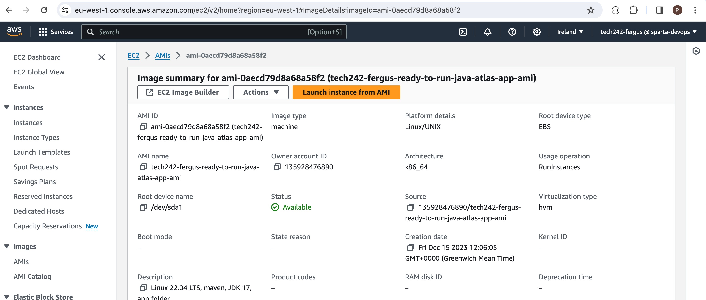

# AWS Instance Launch Process

1.	Enter "cd .ssh" in the terminal to go to relevant directory
2.	Make sure you’re on the Ireland region near top right of screen 
3.	Click Launch Instance
4.	Name instance
5.	Search for AMI 20230424 Ubuntu ending in 1e9 in Community AMIs
    

6.	Instance Type – t2.micro Free Tier Eligible
7.	Select key pair – tech242
8.	Select existing security group or create new one if one does not exist
    

9.	If creating, allow SSH (from your IP) and HTTP traffic
10.	Select my IP
    
11.	Provide security group name
12. If you need to add an additional security group rule, add the port and change the source type to anywhere usually.
    

13.	Check summary then click Launch instance

14.	Copy and paste link e.g. "chmod 400 tech242.pem" from next page into terminal
15.	Copy and paste link e.g. "ssh -i "tech242.pem" ubuntu@ec2-3-249-250-55.eu-west-1.compute.amazonaws.com" from next page into terminal
    

16.	Type and enter yes
17.	Should be connected/logged in, type exit to exit then manually stop on AWS website

# AWS Custom AMI Creation

AMIs (Amazon Machine Images) are like a snapshot or a template of a virtual computer that you can use as a starting point to create new virtual machines. It is like a pre-configured package that includes an operating system, software, and any additional configurations you need. In simple terms, an AMI is a blueprint for creating virtual machines in AWS. You can choose from a variety of publicly available AMIs or create custom ones to suit your specific requirements.

1. On your current running instance you want an image of, click on Actions, scroll down to Image and templates and select Create image.
   

2. Enter an image name e.g. "tech242-fergus-ready-to-run-java-atlas-app-ami"
3. Enter a description e.g. "Linux 22.04 LTS, maven, JDK 17, app folder"

4. Add a new tag at the bottom, key should be Name and the value should be the same as the image name you entered above
   

5. Once those details are entered, hit Create image in the bottom right hand corner.
6. You can then launch an instance from the AMI page you will be redirected to
   

7. Create instance as usual but your custom AMI will now be selected
8. If required make sure to include user data for commands such as cd or mvn spring-boot:start

# AMI Deregistering and Snapshot Deletion

1. Go to the AMIs by clicking AMIs on the left hand side of the screen under Images.
2. Find your specific AMI from the list, check the box and under the actions tab click deregister.
3. A pop up will open and you need to click delete snapshot then follow the hyperlink to open the snapshots in a new tab, this will lead you to the specific snapshot automatically
4. Go back to the AMI and confirm deregister.
5. Go back to the snapshot page, check the box and under actions click delete and confirm.

# Classic Ports To Know
- 22 = SSH (Secure Shell) - log in to Linux instance
- 21 = FTP (File Transfer Protocol) - upload files into a file share
- 22 = SFTP (Secure File Transfer Protocol) - upload files using SSH
- 80 = HTTP - access unsecured websites
- 443 = HTTPS - access secured websites
- 3380 = RDP (Remote Desktop Protocol) - log into a Windows instance

# EC2 Instance Purchasing Options

1. On-Demand Instances
Usage: Ideal for short-term, irregular workloads that cannot be interrupted.
Cost: Pay per second or per hour, depending on the instance type, with no long-term commitment.
Flexibility: Start and stop at any time; no upfront payment.

2. Savings Plans
Usage: Suitable for steady-state usage.
Cost: Offers significant savings over On-Demand pricing in exchange for a commitment to a consistent amount of usage (measured in $/hour) for a 1 or 3-year period.
Flexibility: Two types available - Compute Savings Plans (flexible across instance family, region, OS, or tenancy) and EC2 Instance Savings Plans (specific to instances within a family in a region).

3. Reserved Instances (RIs)
Usage: Best for applications with steady-state needs.
Cost: Up to 75% off the On-Demand price. Pricing varies based on the term length, payment option, and instance type.
Flexibility: Options include Standard RIs (significant discount, best for steady, predictable usage) and Convertible RIs (lower discount, can change the RI attributes).
Commitment: 1-year or 3-year term, with payment options including All Upfront, Partial Upfront, or No Upfront.

4. Spot Instances
Usage: Ideal for flexible, stateless, fault-tolerant, or time-insensitive tasks.
Cost: Up to 90% off the On-Demand price. Pricing fluctuates based on supply and demand.
Flexibility: Can be terminated by AWS with a two-minute notification when AWS needs the capacity back.
Risk: Higher risk of interruption compared to other options.

5. Dedicated Hosts
Usage: Necessary for regulatory requirements that may not support multi-tenant virtualization, or for licensing that doesn’t support cloud deployments.
Cost: Pay for the entire physical server. Can be more expensive than other options.
Flexibility: Physical EC2 server dedicated for your use.
Commitment: Available on-demand (hourly) or as a reservation for up to 70% off the On-Demand price.

6. Dedicated Instances
Usage: Similar to Dedicated Hosts but without the allocation of a physical server.
Cost: More expensive than standard instances but cheaper than Dedicated Hosts.
Flexibility: Instances run in a VPC on hardware that's dedicated to a single customer.
Differences from Dedicated Hosts: Instance capacity is not guaranteed, and instances can’t be used to bring your own license (BYOL).

# AWS Load Balancers

1. Application Load Balancer
- HTTP/HTTPS/gRPC protocols (Layer 7)
- HTTP Routing features
- Static DNS (URL)

2. Network Load Balancer
- TCP/UDP protocols (Layer 4)
- High Performance: millions of requests per second
- Static IP through Elastic IP

3. Gateway Load Balancer
- GENEVE Protocol on IP Packets (Layer 3)
- Route Traffic to Firewalls that you manage on EC2 instances
- Intrusion detection

# Snow Family
## Highly secure, offline, protable devices to collect and process data at the edge and/or migrate data in and out of AWS

1. Snowcone - Data Migration and Edge Computing
- Small, portable computing anywhere, rugged & secure and can withstand harsh environments
- Light
- Used in a space-constrained environment
- Must provide own battery/cables
- Can be sent back to AWS offline or connect it to the internet ans use AWS DataSync to send data
  - Snowcone: 8TB of HDD storage
  - Snowcone SSD: 14TB of HDD storage
- Use cases: Edge computing, stroage and data transfer

2. Snowball Edge - Data Migration and Edge Computing
- Physical transport solution intended to move TBs or PBs in or out of AWS
- Alternative to moving data over a network
- Pay per data transfer job (Data transfer in to Amazon S3 is free)
- Provides block storage and Amazon S3 compatible object storage
  - Snowball Edgee Storage Optimised: 80 TB HDD capacity
  - Snowball Edge Compute Optimised: 42 TB of HDD or 28TB NVMe capacity
- Use cases: Large data cloud migrations, DC commission or disaster recovery

3. Snowmobile - Data Migration
- Transfer exabytes of data (1EB = 1,000PB = 1,000,000TBs)
- Each Snowmobile has 100PB capacity (can use multiple in parallel)
- High security: temperature controlled, GPS and 24/7 video surveillance
- Better than Snowball if you transfer more than 10PB

AWS OpsHub is a UI for managing Snowball devices

# AWS Storage Gateway

- Bridge between on-premises data and cloud data in S3
- Use cases: Disaster recovery, backup & restore and tiered storage

# AWS Databases

## AWS RDS (Relational Database Service)
- A managed DB service using SQL
- Allows you to creates DBs in the cloud that are managed by AWS
  - Postgres
  - MySQL
  - MariaDB
  - Oracle
  - Microsoft SQL Server
  - Aurora (AWS Proprietary database)
### RDS vs Deploying DB on EC2
- Automated provisioning, OS patching
- Continuous backups and restore to specific timestamp (Point in Time Restore!)
- Monitoring dashboards
- Read replicas for improved read performance
- Multi AZ setup for disaster recovery
- Maintenance windows for upgrades
- Scaling capability (vertical and horizontal)
- Storage backed up by EBS
- You CANNOT SSH into your instances

## Amazon Aurora
- Proprietary technology from AWS (not open sourced)
- PostgreSQL and MySQL are both supported
- AWS cloud optimised and claims 5x performance improvement over MySQL on RDS and 3x of Postgres on RDS
- Storage automatically grows in increments of 10GB up to 128TB
- Cost 20% more than RDS but is more efficient
- Not in the free tier
### Aurora Serverless
- Automated database instatiation and auto-scaling based on actual usage
- PostgreSQL and MySQL both supported
- No capacity planning needed
- Least management overhead
- Pay per second, can be more cost effective
- Use cases: Good for infrequent, intermittent or unpredictable workloads

## RDS Deployments

### Read Replicas
- Scale the read workload of your DB
- Can create up to 15 Read Replicas
- Data is only written to the main DB

### Multi-AZ
- Failover in case of AZ outage (high availability)
- Creates replica in another AZ which is only used if the main DB fails
- Data is only read/written to the main DB
- Can only have 1 other AZ as failover

### Multi-Region (Read Replicas)
- Creates Read Replicas in other regions that our application can read, only writes to main DB
- Disaster recovery in case of region issue
- Local performance for global reads
- Replication cost

## Amazon ElastiCache
- ElastiCache is to get managed Redis or Memcached
- Caches are in-memory DBs with high performance and low latency
- Helps reduce load off DBs for read intensive workloads
- AWS handles OS maintenance/patching, optimisations, setup, configuration, monitoring, failure recovery and backups.

## DynamoDB
- A fully managed, highly available DB with replication across 3 AZs
- NoSQL DB, not a relational DB
- Scales to massive workloads, distributed "serverless" DB
- Millions of request per seconds, trillions of rows, 100s of TB of storage
- Fast and consistent performance
- Single-digit millisecond latency, low latency retrieval
- Integrated with IAM for security, authorisation and admin
- Low cost and auto scaling capabilities
- Standard and IA Table Class
- Is a key/value DB
### DynamoDB Acceleraor - DAX
- Fully managed in-memory cache for DynamoDB
- 10 x performance improvement, single digit millisecond latency to microseconds latency when accessing DynamoDB tables
- Secure, HS and HA
- Difference with ElastiCache at the CCP level: DAX is only used for and integrated with DynamoDB.
### DynamoDB - Global Tables
- You can make a DynamoDB table accessible with low latency in multiple regions
- Active-Active replication (read/write to any AWS region)

## Redshift
- Based on PostgreSQL but not used for OLTP (online transaction processing)
- It's OLAP - online analytical processing (analytics and data warehousing)
- Loads data once every hour, not every second
- 10x better performance than other data warehouses and scales to PBs of data
- Columnar storage of data (instead of row based)
- Massive Parallel Query Execution (MPP)
- Pay as you go based on the instances provisioned
- Has a SQL interface for performing queries
- BI (business intelligence) tools such as AWS Quicksight or Tableau integrate with it
### Redshift Serverless
- Automatically provisions and scales data warehouse unerlying capacity
- Run analytics workloads without managing data warehouse infrastructure
- Pay only for what you use (saves cost)
- Use cases: Reporting, dashboarding applications, real-time analytics etc...

## Amazon EMR (Elastic MapReduce) - Not a Database
- Helps create Hadoop Clusters (Big Data) to analyze and process vast amounts of data
- The clusters can be made up of hundreds of EC2 instances
- Also supports Apache Spark, HBase, Presto, Flink...
- Takes care of all the provisioning and configuration of the instances
- Auto-scaling and integrated with Spot instances
- Use cases: Data processing, machine learning, web indexing, big data...

## Amazon Athena
- Serverless query service to perform analytics against S3 objects
- Uses standard SQL language to query the files
- Supports CSV, JSON, ORC, Avro and Parquet
- Use cases: BI/analytics/reporting, analyse and query VPC Flow Logs, ELB Logs, CloudTrail trails etc...

## Amazon QuickSight
- Serverless machine learning-powered BI service to create interactive dashboards
- Fast, automatically scalable, embeddable with per-session pricing
- Integrated with RDS, Aurora, Athena, Redshift, S3 etc...
- Use cases: Business analytics, building visualisations, performing ad-hoc analysis and getting business insights using data

## DocumentDB
- Whereas Aurora is an "AWS-implementation" of PostgreSQL/MySQL, DocumentDB is the same for MongoDB(NoSQL database)
- MongoDB is used to store, query and index JSON data
- Similar deployment concepts to Aurora so it's fully managed, HA with replication across 3 AZs
- DocumentDB storage automatically grows in increments of 10GB
- Automatically scales to workloads with millions of requests per second

## Amazon Neptune
- Fully managed graph database
- A popular graph dataset would be a social network
- HA across 3 AZs with up to 15 read replicas
- Build and run applications working with highly connected datasets, optimised for these complex and hard queries
- Can store up to billions of relations and query the graph with milliseconds latency
- Use cases: Knowledge graphs (Wikipedia), fraud detection, recommendation engines, social networking etc...

## Amazon Timestream
- Fully managed, fast, scalable, serverless time series DB
- Automatically scales up/down to adjust capacity
- Store and analyse trillions of events per day
- 1000s times faster and 1/10th the cost of relational DBs
- Built-in time series analytics functions (helps you identify patterns in your data in near real time)

## Amazon QLDB (Quantum Ledger Database)
- A ledger is a book recording financial transactions
- Full managed, serverless, HA with replcation across 3 AZs
- Used to review history of all the changes made to your application data over time
- Immutable system: No entry can be removed or modified, cryptographically verifiable
- 2-3x better performance than common ledger blockchain frameworks, manipulate data using SQL
- Difference with Amazon Managed Blockchain: no decentralisation component, in accordance with financial regulation rules

## Amazon Managed Blockchain
- Blockchain makes it possible to build applications where multiple parties can execute transactions without the need for a trust, central authority (decentralised)
- AMB is a managed service to:
  - Join public blockcahain networks
  - Create your own scalable private network
- Compatible with the frameworks Hyperledger Fabric and Ethereum

## AWS Glue
- Managed extract, transform and load (ETL) service

## DMS (Data Migration Service)
- Quickly and securely migrate DBs to AWS and is resilient and self healing
- The source DB remains available during migration
- Supports:
  - Homogeneous migrations e.g. Oracle to Oracle
  - Heterogenous migrations e.g. Microsoft SQL Server to Aurora

# Databases & Analytics Summary in AWS (For AWS CCP Exam)
- Relational Databases: OLTP - RDS and Aurora (SQL)
- Difference between Multi-AZ, Read Replicas and Multi-Region
- In-memory Databse: ElastiCache (high performance and low latency)
- Key/Value Database: DynamoDB (serverless) and DAX or DynamoDB Accelerator (cache for DynamoDB)
- Warehouse: OLAP - Redshift (SQL)
- Hadoop Cluster: EMR
- Athena: Query data on Amazon S3 (serverless and SQL)
- QuickSight: Dashboards on your data (serverless)
- DocumentDB: "Aurora for MongoDB" (JSON - NoSQL database)
- Amazon QLDB: Financial Transactions Ledger (immutable journal, cryptographically verifiable)
- Amazon Managed Blockchain: Managed Hyperledger Fabric and Ethereum blockchains
- Glue: Managed ETL (Extract Transform Load) and Data Catalogue service
- Database Migration: DMS
- Neptune: Graph database
- Timestream: Time-series database

# Docker (not on exam)
- Software development platform to deploy apps
- Apps are packaged in containers that can be run on any OS
- Apps run the same, regardless of where they're run
  - Any machine
  - No compatibility issues
  - Predictable behaviour
  - Less work
  - Easier to maintain and deploy
  - Works with any language, any OS, any technology
- Scales containers up and down very quickly (seconds)

## Where Docker images are stored?
- Docker images are stored in Docker Repositories
  - Public: Docker Hub
    - Find bases images for many tecnologies or OS such as Ubuntu, MySQL, NodeJS, Java etc...
  - Private: Amazon ECR (Elastic Container Registry)

## Docker vs Virtual Machines
- Dock is "sort of" a virtualisation technology, but not exactly
- Resources are shared with the host => many containers on one server

# ECS (Elastic Container Service)
- Launch Docker containers on AWS
- You must provision and maintain the infrastructure (the EC2 instances)
- AWS takes care of starting/stopping containers
- Has integration with the Application Load Balancer

# Fargate
- Launch Docker containers on AWS
- You DO NOT provision the infrastructure (no EC2 instances to manage) - simpler.
- Serverless offering
- AWS just runs containers for you based on your CPU/RAM needs

# ECR (Elastic Container Registry)
- Private Docker registry on AWS
- This is where you store your Docker images so they can be run by ECS and Fargate

# Serverless
- A new paradigm in whch the developers don't have to manage servers anymore
- They just deploy code/functions
- Initially serverless == Faas (Function as a Service)
- Serverless was pioneered by AWS Lambda but now also includes anything that's managed: "database, messaging, storage etc."
- There are servers but we don't manage, provision or see them.

# Lambda
- Virtual functions - no servers to manage
- Limited by time - short executions
- Run on-demand
- Scaling is automated
## Benefits
- Easy pricing:
  - Pay per request and compute time
  - Free tier of 1,000,000 AWS Lambda requests and 400,000 GBs of compute time
- Integrated with the whole AWS suit of services
- Event-Driven: functions get invoked by AWS when needed
- Integrated with many programming languages
- Easy monitoring through AWS CloudWatch
- Easy to get more resources per functions (up to 10GB of RAM)
- Increeasing RAM will also improve the CPU and network
## Language Support
- Node.js (JavaScript)
- Python
- Java
- C#
- Golang
- C# / Powershell
- Ruby
- Custom Runtime API (community supported, example Rust)
- Lambda Container Image:
  - The container image must implement the Lambda Runtime API
  - ECS / Fargate is preferred to running arbitrary Docker images

# Amazon API Gateway
- Fully managed service for developers to easily create, publish, maintain, monitor and secure APIs
- Serverless and scalable
- Supports RESTful APIs and WebSocket APIs
- Support for security, user authentication, API throttling, API keys, monitoring etc...
- Use case: building a serverless API
  Client <REST API> API Gateway <PROXY REQUESTS> Lambda <CRUD> DynamoDB

# AWS Batch
- Fully managed batch processing at any scale
- Efficiently run 100,000s of computing batch jobs on AWS
- A "batch" job is a job with a start and an end (as opposed to continuous)
- Batch will dynamically launch EC2 instances or Spot Instances
- AWS Batch provisions the right out of compute/memory
- You submit or schedule batch jobs and AWS Batch does the rest
- Batch jobs are defined as Docker images and run on ECS
- Helpful for cost optimisations and focusing less on infrastructure

# Amazon Lightsail
- Virtual servers, storage, databases and networking
- Low and predictable pricing
- Simpler alternative to using EC2, RDS, ELB, EBS Route 53 etc...
- Great for people with little cloud experience
- Can setup notifications and monitoring of your Lightsail resources
- Has HA but not auto-scaling and limited AWS integrations
- Use cases:
  - Simple web applications (has templates for LAMP, Nginx, MEAN, Node.js)
  - Websites (has templates for WordPress, Magento, Plesk, Joomla)
  - Dev/Test environment

# Other Computer Summary
- Docker: container technology to run applications
- ECS: run Docker containers on EC2 instances
- Fargate: run Docker containers without provisioning the infrastructure (serverless)
- ECR: private Docker images repository
- Batch: run batch jobs on AWS across managed EC2 instances
- Lightsail: predictable and low priving for simple application and DB stacks

# Lambda Summary
- Lambda is serverless, FaaS, seamless scaling and reactive
- Lambda billing:
  - By the time run x by the RAM provisioned
  - By the number of invocations
- Language support: many programming languages except (arbitrary) Docker
- Invocation time up to 15 minutes
- Use an API Gateway to expose Lambda functions as HTTP API
- Use cases: Create thumbnails for images uploaded to S3 or run a serverless cron job

# CloudFormation
- A declarative way of outlinng your AWS infrastructure for any resources (most of them are supported)
- For example, within a CloudFormation template you say:
  - I want a security group
  - I was two EC2 instances using this security group
  - I want an S3 bucket
  - I want a load balancer
- Then CloudFormation creates these for you, in the right order, with the exact configuration you specify
## Benefits
- Infrastructure as code
  - No resources are manually created which is excellent for control
  - Changes to the infrastructure are reviewd through code
- Cost
  - Each resource with the stack is tagged with an identifier so you can easily see how much a stack costs you
  - You can estimate the costs of your resources using the CloudFormation template
  - Savings strategy: As a developer, you could automate the deletion of templates at 5pm and recreation at 8am safely
- Productivity
  - Ability to destroy and recreate an infrastructure on the cloud on the fly
  - Automated generation of Diagram for your templates
  - Declarative programming (no need to figure out ordering and orchestration)
- Don't Reinvent the Wheel
  - Leverage existing templates on the web
  - Leverage the documentation
- Supports (almost) all AWS Resources
  - Everything on this course is supported
  - You can use "custom resources" for resources that are not supported

# AWS CDK (Cloud Development Kit)
- Define your cloud infrastructure using a familiar language
- The code is "compiled" into a CloudFormation template (JSON/YAML)
- You can therefore deploy infrastructure and application runtime code together
  - Great for Lambda functions
  - Great for Docker containers in ECS / EKS

# AWS Elastic Beanstalk
- PaaS
- Developer centric view of deploying an application on AWS
- Uses all the components we've seen before but all in one view
- Still have full control over configuration
- Free but you pay for the underlying instances
- Managed service
  - Instance configuration / OS handled by Beanstalk
  - Deployment strategy is configurable but performed by Elastic Beanstalk
  - Capacity provisioning
  - Load balancing and auto-scaling
  - Application health-monitoring and responsiveness
- Only dev responsibility is application code
- Three architectural models:
  - Single instance deployment: good for development
  - LB and ASG: great for production or pre-production web applications
  - ASG only: great for non-web apps in production

# AWS CodeDeploy
- Hybrid service to reploy applications automatically
- Works with EC2 instances AND On-Premises servers
- Servers/instances must be provisioned and configured ahead of time with the CodeDeploy agents

# AWS CodeCommit
- AWS' competing product to GitHub
- Benefits:
  - Full managed
  - Scalable and highly available
  - Private, secured and integrated with AWS

# AWS CodeBuild
- Code building service in the cloud
- Compiles source code, runs tests and produces packages that are ready to be deployed (e.g.by CodeDeploy)
- Benefits:
  - Full managed and serverless
  - Continuously scalable and HA
  - Secure
  - Pay as you go pricing so only pay for the build time

# AWS CodePipeline
- Orchestrates the steps to have coe automatically pushed to production
- Basis for CICD
- Benefits:
  - Fully managed and compatible with previously mentioned AWS services, alsoe 3rd party services e.g. GitHub and custom plugins
  - Fast delivery and rapid updates

# AWS CodeArtifact
- Software packages depend on each other to be built (dependencies) and new ones are created
- Storing and retrieving these dependencies is call artifact management
- Traditionally you need to set a management system up yourself
- CodeArtifact is a secure, scalable and cost-effective artifact management system for software development
- Works with common dependency management tools such as Maven, Gradle etc
- Developers and CodeBuild can retrieve dependencies straight from CodeArtifact

# AWS CodeStar
- Unified UI to easily manage software development activities in one place
- Quick way to get started to correctly set up all the previous services
- Can edit the code in the cloud using AWS Cloud9

# AWS Cloud9
- A cloud IDE used in the web browser
- Allows collaboration in real time

# AWS Systems Manager (SSM)
- Helps you manage your EC2 and On-Premises systems at scale
- Another Hybrid AWS service
- Get operational insights about the state of your infrastructure
- Suite of 10+ products
- Most important features are:
  - Patching automation for enhanced compliance
  - Run commands across an entire fleet of servers
  - Store parameter configuration with the SSM ParameterStore
- Works for Linux, Windows, MacOS and Raspberry Pi OS (Raspbian)
- SSM Agent is installed by default on Amazon Linux AMI and some Ubuntu AMI, otherwise we need to install it
- If an instance cn't be controlled with SSM, it's probably an issue with the agent
- Thanks to the SSM agent we can run commands, patch and configure our servers

# Systems Manager - SSM Session Manager
- Allows you to start a secure shell on your EC2 and on-premises servers
- No SSH access, bastion hosts or SSH keys needed
- No port 22 needed (better security)
- Supports Linux, MacOS and Windows
- Send session log data to S3 or CloudWatch logs

# SSM Parameter Store
- Secure storage for configurations and secrets
- API keys, passwords, configurations...
- Severless, scalable, durable, easy SDK
- Control access permissions using IAM
- Version tracking and encryption (optional