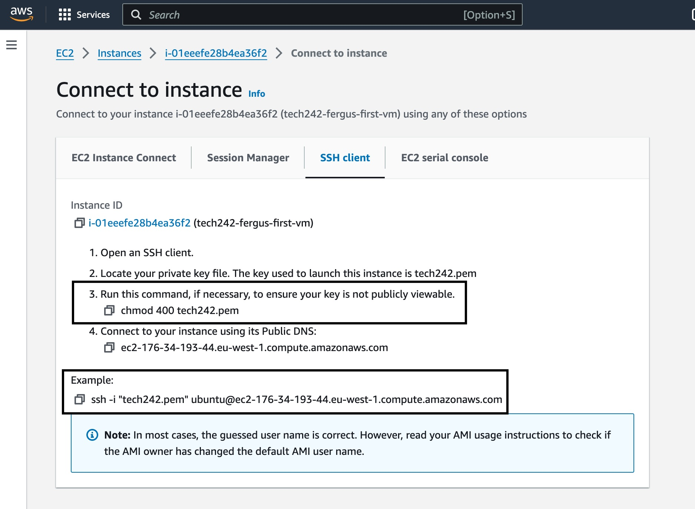

# AWS Instance Launch Process

1.	Enter "cd .ssh" in the terminal to go to relevant directory
2.	Make sure you’re on the Ireland region near top right of screen 
3.	Click Launch Instance
4.	Name instance
5.	Search for AMI 20230424 Ubuntu ending in 1e9 in Community AMIs
    

6.	Instance Type – t2.micro Free Tier Eligible
7.	Select key pair – tech242
8.	Select existing security group or create new one if one does not exist
    

9.	If creating, allow SSH (from your IP) and HTTP traffic
10.	Select my IP
    
11.	Provide security group name
12. If you need to add an additional security group rule, add the port and change the source type to anywhere usually.
    

13.	Check summary then click Launch instance

14.	Copy and paste link e.g. "chmod 400 tech242.pem" from next page into terminal
15.	Copy and paste link e.g. "ssh -i "tech242.pem" ubuntu@ec2-3-249-250-55.eu-west-1.compute.amazonaws.com" from next page into terminal
    

16.	Type and enter yes
17.	Should be connected/logged in, type exit to exit then manually stop on AWS website