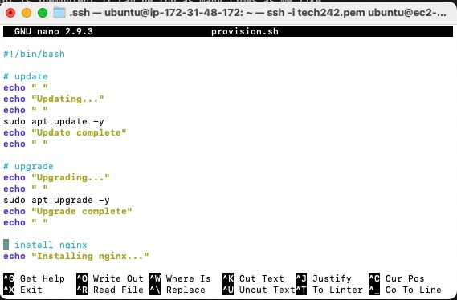
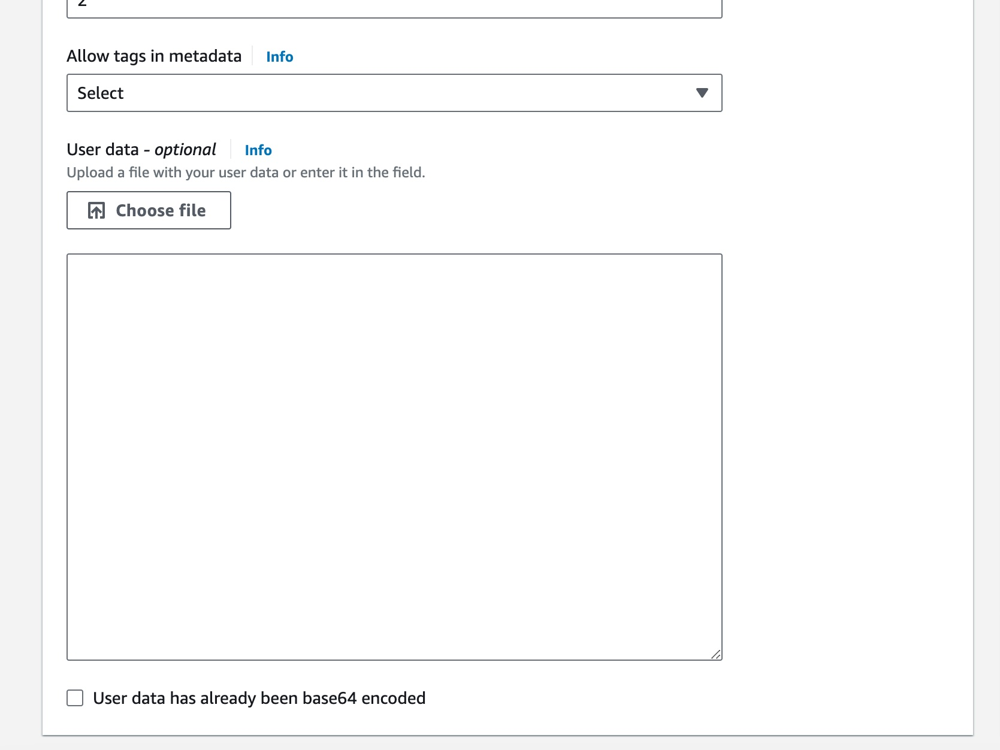

# Linux

- [Linux](#linux)
  - [Bash (Bourne Again Shell) An Interface that Runs Commands](#bash-bourne-again-shell-an-interface-that-runs-commands)
    - [Commands](#commands)
  - [How To Run a Script](#how-to-run-a-script)
    - [Script Specific Commands](#script-specific-commands)
      - [Additional Script Notes](#additional-script-notes)
  - [Using User Data](#using-user-data)
    - [Additional General Notes](#additional-general-notes)
  - [Example Script](#example-script)


## Bash (Bourne Again Shell) An Interface that Runs Commands<br>
### Commands
- uname -a = displays all system information
- --help = displays a help message and exit
- pwd = prints working directory
- cd <directoryname> = Navigate to specified directory
- clear = clears the terminal
- whoami = gets the active username
- curl <fileurl> = download a file from source url
- cp <filename> <newfilename> = copy a file
- rm <filename> = remove a file
- rmdir / rm -d <emptydirectory> or rm -r <notemptyudirectory> = remove a directory
- mv <filename> <renamedfile> OR <destinationfolder> = rename or move file
- mkdir <newdirectoryname> = make new directory
- touch <filename> = make an empty file
- cat <filename> = check file contents
- nano <filename> = modify file contents (ctrl s to save and ctry x to exit) or creates file if it doesn't exist
- head or tail -number <filename> = prints specified number of lines from head or tail
- grep 'word' <filename> or <directory> = search for text in files
- chmod +<permissiontype> <filename> = changes file permissions
- chown = granting ownership of files or folders
- sudo = command to escalate privileges
- whatis <command> = find out what a command is used for
- ls -l = permissions
- ls -a = list all files in directory
- export = assign environment variable
- man <command> = manual for a specific command
- ps aux = all processes but not in real time
- jobs = all processes in real time organised by CPU usage
- sleep = similar to wait and include & to run in background
- kill <PID> = to terminate process or include -9 after kill to brute force

## How To Run a Script
1. Shell script files end in .sh
2. Shell scripts start with #!/bin/bash which is the path pointing to the interpreter
3. Annotate with comments to plan your script
4. Test commands manually before adding to the script
5. Include echoes in script
6. To run script, provide path to run script but may need to change permission of x first.  E.g. ./provision-test.sh
7. If a script is idempotent it can be run as many times as we like

   

### Script Specific Commands
- sudo apt update -y = downloads updates and is a good way to check internet connection
- sudo apt upgrade -y = installs the updates (NB. must avoid user interaction)
- sudo apt install nginx -y = installs nginx (NB. must avoid user interaction)
- sudo DEBIAN_FRONTEND=noninteractive apt install maven -y (NB. must avoid user interaction)
- sudo DEBIAN_FRONTEND=noninteractive apt install openjdk-17-jdk -y (NB. must avoid user interaction)
- sudo systemctl status nginx = check manager processes
- sudo systemctl restart nginx = restarts nginx which we do if we have changed the configurations and want to apply
- sudo systemctl enable nginx = starts process/service automatically at boot

#### Additional Script Notes
- Add "sudo DEBIAN_FRONTEND=noninteractive" in front of upgrade command and any installation commands to avoid any user interaction
- To copy a file "scp -i ~/.ssh/my-ssh-key LOCAL_FILE_PATH USERNAME@IP_ADDRESS:~" so an example is "scp -i ~/.ssh/tech242.pem ~/Documents/sendthisover.txt ubuntu@18.202.234.49:~"
- To copy a folder "scp -r -i ~/.ssh/tech242.pem ~/Desktop/Test-Folder ubuntu@3.254.95.144:~"

## Using User Data
1. When creating instance, at the bottom open up advanced details.
2. Go right to the bottom and copy and paste (or upload script file) 
3. 
  

### Additional General Notes
- ~ is a tilda and means home directory
- / means root and root is higher than home directory
- Absolute Path starts at the root directory
- Environment variable can be used to store sensitive data
- Process is something in memory and posibly using the CPU
- System processes dont provide application or interface for user to use
- User processes relate to a terminal session
- Single core can only process one at a time

scp -r -i ~/.ssh/tech242.pem /Users/jackiethompson/Documents/ForCloud/Documents/app-code/jsonvoorhees-java-atlas-app ubuntu@ec2-3-254-95-144.eu-west-1.compute.amazonaws.com:~


## Example Script
```
#!/bin/bash

# update & upgrade
echo "Updating..."
echo ""
sudo apt update -y
echo ""
echo "Update complete"
echo ""
echo "Upgrading..."
echo ""
sudo DEBIAN_FRONTEND=noninteractive apt upgrade -y
echo ""
echo "Upgrade complete"
echo ""

# install maven
echo "Installing Maven..."
echo ""
sudo DEBIAN_FRONTEND=noninteractive apt install maven -y
echo ""
echo "Maven install complete"
echo ""

# check maven is installed
echo "Confirming Maven installation..."
echo ""
mvn -version
echo ""

# install JDK java 17
echo "Installing JDK Java 17..."
echo ""
sudo DEBIAN_FRONTEND=noninteractive apt install openjdk-17-jdk -y
echo ""
echo "JDK Java 17 complete"
echo ""

# check JDK java 17 is installed
echo "Confirming JDK Java 17 installation..."
echo ""
java -version
echo ""

# copy the app code to this VM
echo "Cloning repository..."
echo ""
git clone https://github.com/FThompsonSG/tech242-jsonvoorhees-app.git repo
echo ""
echo "Repository cloned."
echo ""

# cd into the right folder and run the app
echo "Moving into correct folder..."
echo ""
cd repo/springapi
echo "Successfully moved into correct folder"
echo ""
echo "Running app..."
echo ""
mvn spring-boot:start
echo ""
echo "App running successfully"

# Define variables
DOMAIN=$(curl ifconfig.me)
TARGET_IP=$(curl ifconfig.me)
TARGET_PORT="5000"

# Install Apache
sudo DEBIAN_FRONTEND=noninteractive apt install apache2 -y

# Enable necessary Apache modules
sudo a2enmod proxy
sudo a2enmod proxy_http
sudo a2enmod proxy_balancer
sudo a2enmod lbmethod_byrequests

# Create a virtual host configuration file
sudo tee /etc/apache2/sites-available/reverse-proxy.conf > /dev/null <<EOL
<VirtualHost *:80>
    ServerName $DOMAIN

    ProxyPreserveHost On
    ProxyPass / http://$TARGET_IP:$TARGET_PORT/
    ProxyPassReverse / http://$TARGET_IP:$TARGET_PORT/

    ErrorLog \${APACHE_LOG_DIR}/error.log
    CustomLog \${APACHE_LOG_DIR}/access.log combined
</VirtualHost>
EOL

# Enable the virtual host
sudo a2ensite reverse-proxy

# Reload Apache to apply changes
sudo systemctl reload apache2

```